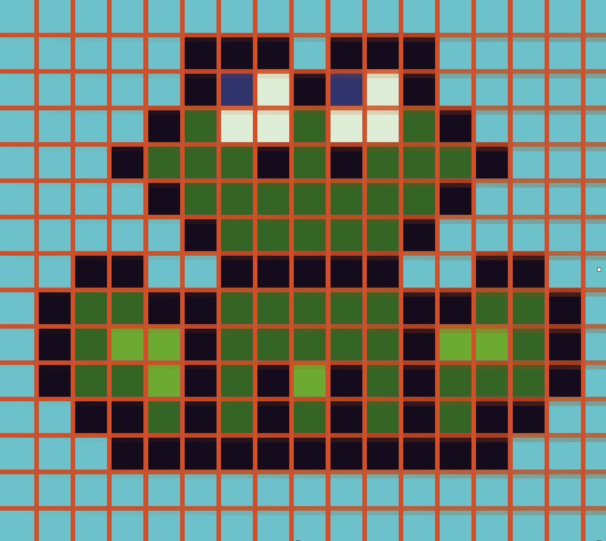

# Een eerste versie van Froggy Road

Froggy Road

```
$ give me super-powers
```


 Super-powers are granted randomly so please submit an issue if you're not happy with yours.


Once you're strong enough, save the world:


```bash
# Ain't no code for that yet, sorry
echo 'You got to trust me on this, I saved the world'
```


Froggy Road


Eerst een kort stukje uitleg voor we beginnen. Je hoeft dit niet allemaal precies te snappen, maar lees het een keer door.

Computer graphics en Computer Games

Plaatjes op de computer bestaan uit kleine beeldpunten, die we “pixels†noemen. Oude computers konden nog niet zoveel pixels tegelijk tekenen, dus waren de pixels heel groot en kon je ze goed zien. Daarom heten plaatjes in de stijl van oude computerspelletjes ook wel “pixel art”. Als je op de computer een plaatje wilt tekenen, ben je dus al die pixels een kleurtje aan het geven. Meestal doe je dat door plaatjes die je in je geheugen hebt op het scherm te “stempelen†op verschillende plaatsen.

## Sprites

Het geheugen van de computer waar de plaatjes worden opgeslagen is opgedeeld in kleine vakjes, van 8 bij 8 pixels groot. Je kunt deze vakjes met code op het scherm tekenen, in groepjes van 8x8, 16x16 of 32x32. Onze kikker is bijvoorbeeld 16x16 pixels groot. Elk plaatje wat je zo op het scherm tekent heet een “sprite”. In het plaatje hieronder kun je zien hoe alle sprites naast elkaar in het geheugen zitten. Elke sprite heeft een nummer, en het is zelf de bedoeling dat je bijhoudt hoeveel 8x8 vakjes er bij elke sprite horen.

Het scherm van de TIC-80 is 240 pixels breed en 134 pixels hoog. Dat is dus 30 vakjes van 8x8 breed en 17 hoog. Niet zo heel veel, maar genoeg om een spelletje mee te maken!

## Objecten

Als we plaatjes op het scherm willen tekenen, moeten we weten op welke plaats we ze moeten tekenen. We houden in het geheugen van de computer alle “dingen†bij die belangrijk zijn voor ons spelletje \(bijvoorbeeld: een kikker of een auto\), zodat we die vervolgens op de juiste plaats kunnen tekenen. Vanaf nu gaan we de “dingen†die we gaan laten bewegen of waar je tegenaan kan lopen “objecten”.

Alle objecten hebben een X en een Y positie op het scherm. Die positie houden we bij in **variabelen,** bijvoorbeeld **x** en **y**.

kikker\_x = 112

kikker\_y = 112

**LET OP!** De Y-as loopt andersom dan je van wiskunde gewend bent. Op de computer zit Y=0 bovenaan het scherm, en worden de getallen lager als je naar beneden gaat.

Je kunt variabelen ook in een groepje bij elkaar stoppen, in een **objectvariabele**. Dat ziet er zo uit:

kikker = { x=112, y=112 }

Je kunt de variabelen in een object precies hetzelfde gebruiken als gewone variabelen, door een punt \( **.** \) te typen tussen de naam van het object en de naam van de variabele. Bijvoorbeeld:

kikker.y = kikker.y + 3

We gaan van de kikker niet alleen bij houden waar hij getekend moet worden, maar ook hoe groot hij is \(hoe breed en hoe hoog\). Dat gaat straks van pas komen als we moeten kijken of de kikker en de auto met elkaar botsen. De breedte slaan we op in de variabele **w** \(van het Engelse “width”\) en de hoogte in de variabele **h** \(van het Engels “height”\).

Dus de hele kikker ziet er in ons geheugen zo uit:

kikker = { x=112, y=112, w=16, h=16 }

## De “Game Loop”

Alle spellen bestaan uit twee stappen die na elkaar steeds maar weer in een lus uitgevoerd worden, namelijk **rekenen** en **tekenen**.

In de stap **rekenen** kijk je naar de invoer van de speler, en laat je de computervijanden bewegen. Dit doe je allemaal door variabelen in je geheugen te veranderen \(bijvoorbeeld: de positie van de kikker of van de auto\).

In de tweede stap, **rekenen**, ga je de variabelen gebruiken om de kikker en de auto op de juiste plek op het scherm te tekenen, zodat de speler kan zien wat er allemaal gebeurd is.

Je moet dus een variabele hebben voor alles wat je wilt kunnen veranderen, zodat je de waarde kan aanpassen in **rekenen** en het resultaat kunt laten zien in **tekenen**. Positie van de kikker? Daar heb je een variabele voor. Of de kikker levend of dood getekend moet worden? Ook een variabele. Of het spel afgelopen is of nog loopt? Nog een variabele. De meeste variabelen die je nodig hebt zitten al in het beginbestand wat je gekregen hebt, maar sommige zul je er later zelf bij moeten maken.

In de code van de TIC-80 ziet de verdeling in **rekenen** en **tekenen** er als volgt uit:

function TIC\(\)

 rekenen\(\)

 tekenen\(\)

end

function rekenen\(\)

 —- Hier wordt gerekend

end

function tekenen\(\)

 —- Hier wordt getekend

end

De functie **TIC\(\)** wordt automatisch door de TIC-80 computer in een oneindige lus aangeroepen. Daarna roepen we zelf **rekenen\(\)** en vervolgens **tekenen\(\)** aan, waar het echte werk gebeurt.

## Lua

De TIC-80 wordt geprogrammeerd in Lua. Dat is een programmeertaal net als Python of JavaScript. Hij ziet er misschien net iets anders uit dan je gewend bent van andere programmeertalen, maar hij werkt eigenlijk precies hetzelfde. Je hebt ook variabelen, een **if** en **functies**, en een manier om commentaar te schrijven.

Commentaar

Alles wat achter twee streepjes staat, hoort niet bij je programma. Dat heet “commentaar”, en kun je gebruiken om aan jezelf en aan anderen uit te leggen hoe je programma werkt. Bijvoorbeeld:

 —- Dit programma werkt supergoed!

Functies aanroepen

Functies zijn opdrachten die je aan de computer kan geven om iets te doen, of vragen die je aan de computer kunt stellen. Zoals bijvoorbeeld: “teken deze sprite op deze op deze plek” \(met de functie **spr\(\)**\) of “heeft de speler op een knop gedrukt?” \(met de functie **btnp\(\)**\).

Als je een functie wilt aanroepen \(dus een opdracht wilt geven\), schrijf je de naam van de functie en daarachter haakjes. Meestal heeft een functie _parameters,_ die schrijf je dan tussen de haakjes. Bijvoorbeeld:

print\(“Hallo”, 0, 0\)

Op de laatste bladzijde van dit boekje vind je een lijst van alle functies die je nodig hebt voor deze workshop.

Variabelen

Een variabele is een manier om een naam aan een waarde te koppelen. Variabelen kun je veranderen en ook weer uitlezen, bijvoorbeeld als je een functie aanroept:

regel = 5

regel = regel + 10

print\(“Dit staat op regel 15”, 0, regel\)

if/then

Een **if** is een manier om een stukje code alleen uit te voeren in speciale gevallen. Bijvoorbeeld als de speler op een knop drukt, of als een variabele groter is dan een bepaalde drempelwaarde. Een **if** schrijf je als **if … then … end**.

Als je het volgende stukje code steeds opnieuw uitvoert heeft **teller** de waardes 1, 2, 3, 1, 2, 3, 1, 2, 3… enzovoorts:

teller = teller + 1

if teller > 3 then

 teller = 1

end

Gewapend met deze kennis ben je klaar om te beginnen!

Beginnen met de TIC-80 computer

Als je de TIC-80 net hebt opgestart begin je in een scherm waar je begint met commando’s typen. Hier kun je je spellen laden en opslaan en starten. Als het goed is heb je bij deze workshop een bestand gekregen wat **workshop.tic** heet.

Typ eerst **folders** \(en druk op ENTER\) om het mapje waar je **.tic** bestanden opslaat te openen. Kopiëer **workshop.tic** daar naartoe.

  
Vervolgens typ je **load workshop** om het bestand te laden.

Om het spelletje te starten typ je **run**, of je drukt op **Ctrl-R** of ⌘**-R**.

Als je op **ESC** drukt ga je naar de code editor waar je kunt programmeren, en met nog een keer **ESC** ga je weer terug.


Als je je spel wilt bewaren, typ je **save**.

1. Laat de kikker bewegen

Als we beginnen zien we een kikker op het scherm, maar de kikker kan nog niet bewegen.

| 👉 | Zorg dat als je op PIJLTJE OMHOOG op je toetsenbord drukt, de kikker OMHOOG beweegt. |
| :--- | :--- |


Ergens in de functie **rekenen\(\)** kijken we met een **if** of er een knop ingedrukt wordt \(met de functie **btnp\(\)**\). Als dat zo is, dan moeten we iets gaan doen om de positie van de kikker te veranderen. Wat moet hier komen?

if btnp\(0\) then

 -- OPDRACHT 1

 -- Wat moet hier komen?

end

Denk na over de grootte van de stappen. 8 of 16 zijn getallen die ik goed vind werken, maar je mag natuurlijk kiezen wat je zelf wil!

<table>
  <thead>
    <tr>
      <th style="text-align:left">&#x1F4A1;</th>
      <th style="text-align:left">
        <p><b>Tip</b>
        </p>
        <p>Geef <b>kikker.y</b> een nieuwe waarde, door een getal op te tellen of af
          te trekken van de oude <b>kikker.y</b>. Denk goed na of de Y coordinaat
          lager of hoger moet worden!</p>
      </th>
    </tr>
  </thead>
  <tbody></tbody>
</table><table>
  <thead>
    <tr>
      <th style="text-align:left">&#x1F9E0;</th>
      <th style="text-align:left">
        <p><b>Extra</b>
        </p>
        <p>Als je de overkant haalt zie je een tekst. Pas de tekst aan om jezelf
          eens passend te feliciteren.</p>
      </th>
    </tr>
  </thead>
  <tbody></tbody>
</table><table>
  <thead>
    <tr>
      <th style="text-align:left">&#x1F9E0;</th>
      <th style="text-align:left">
        <p><b>Extra</b>
        </p>
        <p>Kun je de kikker ook weer naar beneden laten bewegen als je op PIJLTJE
          OMLAAG duwt?</p>
        <p>(tip: kijk op het laatste blad naar de lijst van functies)</p>
      </th>
    </tr>
  </thead>
  <tbody></tbody>
</table>1. Laat de kikker bewegen \(uitleg\)

Omdat de Y as naar beneden loopt, moet de waarde van **kikker.y** _lager_ worden om de kikker _omhoog_ te laten lopen. Ik vind stapjes van 8 pixels goed werken:

if btnp\(0\) then

 kikker.y = kikker.y - 8

end

Als je ook teruguit wilt kunnen lopen, ze je dit eronder:

if btnp\(1\) then

 kikker.y = kikker.y + 8

end

**btnp\(1\)** omdat 1 het nummer is van de knop PIJLTJE OMLAAG, en **kikker.y + 8** omdat **+** ervoor zorgt dat de kikker naar beneden beweegt.

2. Achtergrond toevoegen

De omgeving van de kikker is nu een beetje saai. Laten we de kikker eens iets geven om naartoe te rennen. Bijvoorbeeld: een vijvertje om lekker in te zwemmen!

Als je in de editor op MAP EDITOR \(F3\) klikt, kom je in een scherm waar je de achtergrond kan tekenen. De kaart bestaat uit een heleboel tegels van 8x8 pixels.

| 👉 | Zorg dat er een achtergrond onder de kikker getekend wordt. |
| :--- | :--- |


Je kunt wat je getekend hebt in de MAP EDITOR in code op het scherm tekenen door op de juiste plek een aanroep naar de **map\(\)** functie neer te zetten.

Waar moet die functie komen denk je? In **rekenen\(\)** of in **tekenen\(\)**?

Zoek de **map\(\)** functie op op het spiekbriefje \(achterin\) en kijk goed welke parameters die functie nodig heeft, en in welke volgorde.

<table>
  <thead>
    <tr>
      <th style="text-align:left">&#x1F4A1;</th>
      <th style="text-align:left">
        <p><b>Tip</b>
        </p>
        <p>Als je het hele scherm wilt vullen, deel je het aantal pixels in het scherm
          door de grootte van een tegel om het aantal tegels uit te rekenen.</p>
      </th>
    </tr>
  </thead>
  <tbody></tbody>
</table><table>
  <thead>
    <tr>
      <th style="text-align:left">&#x1F9E0;</th>
      <th style="text-align:left">
        <p><b>Extra</b>
        </p>
        <p>Teken vooral een andere/leukere achtergrond als je wilt. Door op SHIFT
          te drukken kun je andere tegels kiezen om mee te tekenen.</p>
      </th>
    </tr>
  </thead>
  <tbody></tbody>
</table>2. Achtergrond toevoegen \(uitleg\)

Je roept **map\(\)** als volgt aan om het hele scherm te vullen met de achtergrond:

map\(0, 0, 30, 17\)

0, 0 is omdat je vanaf de eerste tegel op de kaart wilt beginnen met tekenen \(positie in tegelcoordinaten\).

30, 17 zijn het aantal tegels in de breedte en in de hoogte. Het scherm is 240 pixels breed en 136 pixels hoog, dus 240 pixels breed gedeeld door 8 pixels per tegel = 30 tegels, en 136 pixels / 8 pixels per tegel = 17 tegels.

Het is belangrijk in welke volgorde je alle tekenopdrachten geeft, omdat de latere over de eerste heentekenen. De **map\(\)** moet dus vóór de **spr\(\)** waarmee de kikker getekend wordt, anders zie je de kikker niet meer!


3. Het eerste obstakel

Het spel is nu natuurlijk wel erg makkelijk, je kan zó naar de overkant lopen! Tijd om een obstakel toe te voegen.

Als je in de editor op SPRITE EDITOR \(F2\) klikt, zie je dat we ook plaatjes van auto’s hebben, maar in het spel is er nog geen auto te bekennen.

| 👉 | Zorg dat de auto op het scherm getekend wordt. |
| :--- | :--- |


Net als voor de kikker, hebben we ook al een object voor de auto \(het heet, toepasselijk genoeg, **auto**!\). Net als bij de kikker moet de auto wel op het scherm getekend worden. Dat doe je met de **spr\(\)** functie. Je moet de **spr\(\)** functie vertellen welke sprite \(of sprites\) hij moet tekenen, en waar. Alle sprites hebben een nummer, dat je kan vinden door er op te klikken in de SPRITE EDITOR \(staat achter de \# links\).

Zoek op hoe de **spr\(\)** functie werkt \(spiek maar lekker bij hoe de kikker getekend wordt\), en teken de auto ook op het scherm. Let op het spritenummer en de afmetingen van de auto.

<table>
  <thead>
    <tr>
      <th style="text-align:left">&#x1F4A1;</th>
      <th style="text-align:left">
        <p><b>Tip</b>
        </p>
        <p>Om bij het aantal tegels te komen moet je (helaas!) een heleboel parameters
          opgeven die we eigenlijk helemaal niet nodig hebben. Daar moet je dan maar
          even getallen invullen die niets veranderen.</p>
      </th>
    </tr>
  </thead>
  <tbody></tbody>
</table><table>
  <thead>
    <tr>
      <th style="text-align:left">&#x1F9E0;</th>
      <th style="text-align:left">
        <p><b>Extra</b>
        </p>
        <p>Als je het spel te makkelijk vindt, zoek dan op waar de snelheid van de
          auto geregeld wordt en laat hem sneller rijden.</p>
      </th>
    </tr>
  </thead>
  <tbody></tbody>
</table>3. Het eerste obstakel \(uitleg\)

De **spr** aanroep is erg lang, en een heleboel parameters doen er niet toe. Hij ziet er zo uit:

spr\(33, auto.x, auto.y, 1,1,0,0,4,2\)

Dit is wat ze allemaal betekenen:

id=33 — is het spritenummer van de rode auto

x,y=auto.x, auto.y — zijn de pixelcoordinaten van de auto

colorkey=1 — de eerste 1 zorgt ervoor dat de kleur met nummer 1 doorzichtig getekend wordt. Kijk maar eens wat er gebeurt als je dit verandert in 6.

scale=1 — de tweede 1 zorgt ervoor dat de tekening op normale grootte wordt getekend. Kijk maar eens wat er gebeurt als je dit verandert in 2.

flip=0 — we willen de tekening niet spiegelen

rotate=0 — we willen de tekening niet draaien

w,h=4,2 — de auto is 4 tegels breed en 2 tegels hoog

4. Botsen \(“collission detection”\)

We hebben een kikker, we hebben een auto… maar er gebeurt niets als de auto de kikker raakt. Dat is een beetje saai zo!

| 👉 | Zorg dat je het spel verliest als je door de auto geraakt wordt. |
| :--- | :--- |


TIC-80 weet niks van wat dingen voorstellen. Het enige wat de computer weet is dat jij wat plaatjes op een bepaalde plaats op het scherm getekend hebt, maar niet dat die dingen een speler of een obstakel zijn. Wat jij als programmeur dus moet doen is bijhouden waar elk object op het scherm staat en hoe groot het is, en met een berekening kijken of ze elkaar aanraken.

De code om te kijken of de kikker met de auto gebotst is staat al in het programma:

-- Zijn we gebotst met de auto?

if bots\(kikker, auto\) then

 kikker\_kan\_bewegen = false

end

Maar de functie **bots\(\)** is nog niet ingevuld:

-- Geeft terug of rechthoeken r en s elkaar aanraken

function bots\(r, s\)

 return false

end

Deze functie gaan we invullen.

<table>
  <thead>
    <tr>
      <th style="text-align:left">&#x1F4A1;</th>
      <th style="text-align:left">
        <p><b>Tip</b>
        </p>
        <p>Dit stukje is best wel lastig! Als je het leuk vindt om dit uit te puzzelen,
          dan mag dat. Maar je mag de functie <b>bots()</b> ook behandelen als een
          balpen: iemand anders heeft hem al voor je gemaakt en jij gebruikt hem
          gewoon. Als je dat wilt doen, kun je hem gewoon overtypen van de volgende
          bladzijde.</p>
      </th>
    </tr>
  </thead>
  <tbody></tbody>
</table>Er zijn verschillende manieren om collission detection te doen. Wat wij gaan doen is de kikker en auto behandelen als rechthoeken. Die rechthoeken noemen we **r** en **s**, en ze hebben allebei een \(x, y\) als linkerbovenhoek en een breedte \(w\) en hoogte \(h\). De vraag is, overlappen de rechthoeken elkaar?


Dit schrijven we op als een stel vergelijkingen tussen de zijdes van **r** en **s**. De functie komt er ongeveer zo uit te zien: \(maar niet precies zo, want dit antwoord is fout!\)

function bots\(r, s\)

 return r.x + r.w &gt; s.x

 and r.y + r.h &lt; s.y

 and ...

end

Teken op een kladblaadje een aantal rechthoeken in verschillende posities ten opzichte van elkaar \(links, rechts, boven onder, wel of niet overlappend\) om een gevoel te krijgen voor de gevallen waar je aan moet denken.

Tip: er zijn meerdere goede antwoorden, één ervan werkt zo:

function bots\(r, s\)

 return linkerkant R is links van rechterkant S

 and bovenkant R is boven onderkant S

 and rechterkant R is rechts van linkerkant S

 and onderkant R is onder bovenkant S

end

<table>
  <thead>
    <tr>
      <th style="text-align:left">&#x1F9E0;</th>
      <th style="text-align:left">
        <p><b>Extra</b>
        </p>
        <p>Zorg dat je goed kan zien dat de kikker overreden is. Dit doe je door
          een ander plaatje te gebruiken als de kikker getekend wordt. Je hebt dus
          een variabele nodig om bij te houden welk plaatje gebruikt moet worden.</p>
      </th>
    </tr>
  </thead>
  <tbody></tbody>
</table>4. Botsen \(Uitleg\)

Laten we eens kijken naar de hint van wat we moeten berekenen:

linkerkant R is links van rechterkant S

“is links van” betekent “kleiner dan” &lt;

linkerkant R &lt; rechterkant S

“linkerkant R” is r.x

r.x &lt; rechterkant S

“rechterkant S” is s.x + s.w

r.x &lt; s.x + s.w

Als we dat voor alle zijdes doen, komt **bots\(\)** er zó uit te zien:

function bots\(r, s\)

 return r.x &lt; s.x + s.w

 and r.y &lt; s.y + s.h

 and r.x + r.w &gt; s.x

 and r.y + r.h &gt; s.y

end

5. Meer auto’s

We kunnen nu in ieder geval botsen, maar het spel is nog steeds wel een beetje makkelijk met maar één auto.

| 👉 | Voeg een tweede auto toe \(liefst op de andere rijbaan, maar overal mag\). Zorg natuurlijk ook dat je door die auto geraakt kan worden. |
| :--- | :--- |


De makkelijkste manier om een tweede auto toe te voegen is om alles te kopiëren wat er geschreven is voor de eerste auto, en dat dan aan te passen. Om te beginnen heb je een nieuwe variabele nodig, en daarna kopieer je de andere regels ook.

<table>
  <thead>
    <tr>
      <th style="text-align:left">&#x1F9E0;</th>
      <th style="text-align:left">
        <p><b>Extra</b>
        </p>
        <p>Misschien is het nog leuker als de twee auto&#x2019;s niet even snel rijden.
          Probeer dat eens!</p>
      </th>
    </tr>
  </thead>
  <tbody></tbody>
</table><table>
  <thead>
    <tr>
      <th style="text-align:left">&#x1F9E0;</th>
      <th style="text-align:left">
        <p><b>N&#xF3;g meer auto&#x2019;s (geavanceerd)</b>
        </p>
        <p>Twee auto&#x2019;s is leuk, maar als je steeds meer auto&#x2019;s toe
          wilt voegen wordt het wel erg veel werk om steeds meer variabelen toe te
          voegen. Als je een <b>lijst</b> van objecten bijhoudt, kun je zoveel auto&#x2019;s
          als je wilt hebben zonder dat het meer code kost.</p>
        <p>Lijsten in Lua werken zo:</p>
        <p>-- Nieuwe lege lijst voor auto&apos;s</p>
        <p>autos = {}</p>
        <p>-- Voeg auto&apos;s toe aan de lijst</p>
        <p>table.insert(autos, {x=112, y=83, w=32, h=16})</p>
        <p>table.insert(autos, {x=0, y=15, w=32, h=16})</p>
        <p>-- Doe iets met iedere auto</p>
        <p>for i, auto in pairs(autos)</p>
        <p>spr(1, auto.x, auto.y, ... )</p>
        <p>end</p>
      </th>
    </tr>
  </thead>
  <tbody></tbody>
</table>Spiekbriefje

Je hoeft heus niet alles uit je hoofd te leren. Op dit blad kun je opzoeken hoe alle details ook weer werken.

## Functies

De TIC-80 heeft een aantal ingebouwde functies die je kunt gebruiken om spelletjes mee te maken. Een lijst van alle functies kun je vinden op [https://github.com/nesbox/TIC-80/wiki](https://github.com/nesbox/TIC-80/wiki).

**cls\(color\)** — Vul het hele scherm met het kleurnummer in **color** \(kleurnummers tussen 0 en 15\).

**map\(x, y, w, h, sx, sy\)** — Teken de tegels van de kaart op het scherm. Begin te tekenen bij tegel **\(x, y\)** op de kaart, en teken **w** tegels breed en **h** tegels hoog. **sx** en **sy** mag je weglaten. Als ze gegeven zijn, zijn dat pixelcoördinaten op het scherm om te tekenen.

**spr\(id, x, y, colorkey, scale, flip, rotate, w, h\)** — Teken de sprite met nummer **id** op het scherm op **\(x, y\)**. De kleur met nummer **colorkey** wordt doorzichtig getekend. **scale**, **flip** en **rotate** veranderen hoe de sprite getekend wordt op het scherm. **w** en **h** geven aan hoeveel vakjes naast elkaar en boven elkaar getekend moeten worden.

**btn\(id\)/btnp\(id\)** — Of er een knop ingedrukt is. Met **btn\(\)** kun je de knop vasthouden, met **btnp\(\)** moet je hem eerst loslaten. Knoppen hebben nummers:

0 = omhoog, 1 = omlaag, 2 = links, 3 = rechts

4 = Z, 5 = X, 6 = A, 7 = S

**print\(text, x, y, \[color\]\)** — Print de tekst op de aangegeven plek.

\(Een volledige lijst is te vinden op [https://github.com/nesbox/TIC-80/wiki](https://github.com/nesbox/TIC-80/wiki)\)

