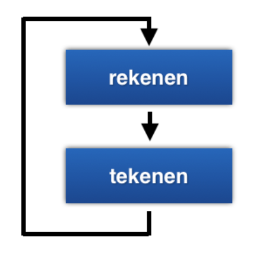

# Introductie gamedevelopment


Eerst een kort stukje uitleg voor we beginnen. Je hoeft dit niet allemaal precies te snappen, maar lees het een keer door.

# Computer graphics en Computer Games

Plaatjes op de computer bestaan uit kleine beeldpunten, die we “pixels” noemen. Oude computers konden nog niet zoveel pixels tegelijk tekenen, dus waren de pixels heel groot en kon je ze goed zien. Daarom heten plaatjes in de stijl van oude computerspelletjes ook wel “pixel art”. Als je op de computer een plaatje wilt tekenen, ben je dus al die pixels een kleurtje aan het geven. Meestal doe je dat door plaatjes die je in je geheugen hebt op het scherm te “stempelen” op verschillende plaatsen.

## Sprites

Het geheugen van de computer waar de plaatjes worden opgeslagen is opgedeeld in kleine vakjes, van 8 bij 8 pixels groot. Je kunt deze vakjes met code op het scherm tekenen, in groepjes van 8x8, 16x16 of 32x32. Onze kikker is bijvoorbeeld 16x16 pixels groot. Elk plaatje wat je zo op het scherm tekent heet een “sprite”. In het plaatje hieronder kun je zien hoe alle sprites naast elkaar in het geheugen zitten. Elke sprite heeft een nummer, en het is zelf de bedoeling dat je bijhoudt hoeveel 8x8 vakjes er bij elke sprite horen.


Het scherm van de TIC-80 is 240 pixels breed en 134 pixels hoog. Dat is dus 30 vakjes van 8x8 breed en 17 hoog. Niet zo heel veel, maar genoeg om een spelletje mee te maken!!

## Objecten


Als we plaatjes op het scherm willen tekenen, moeten we weten op welke plaats we ze moeten tekenen. We houden in het geheugen van de computer alle “dingen” bij die belangrijk zijn voor ons spelletje (bijvoorbeeld: een kikker of een auto), zodat we die vervolgens op de juiste plaats kunnen tekenen. Vanaf nu gaan we de “dingen” die we gaan laten bewegen of waar je tegenaan kan lopen “objecten”.

Alle objecten hebben een X en een Y positie op het scherm. Die positie houden we bij in **variabelen,** bijvoorbeeld **x** en **y**.

```lua  
kikker_x = 112

kikker_y = 112
```
**LET OP!** De Y-as loopt andersom dan je van wiskunde gewend bent. Op de computer zit Y=0 bovenaan het scherm, en worden de getallen lager als je naar beneden gaat.

Je kunt variabelen ook in een groepje bij elkaar stoppen, in een **objectvariabele**. Dat ziet er zo uit:

```lua
kikker = { x=112, y=112 }
```

Je kunt de variabelen in een object precies hetzelfde gebruiken als gewone variabelen, door een punt ( **.** ) te typen tussen de naam van het object en de naam van de variabele. Bijvoorbeeld:

```lua
kikker.y = kikker.y + 3
```

We gaan van de kikker niet alleen bij houden waar hij getekend moet worden, maar ook hoe groot hij is (hoe breed en hoe hoog). Dat gaat straks van pas komen als we moeten kijken of de kikker en de auto met elkaar botsen. De breedte slaan we op in de variabele **w** (van het Engelse “width”) en de hoogte in de variabele **h** (van het Engels “height”).

Dus de hele kikker ziet er in ons geheugen zo uit:
```lua
kikker = { x=112, y=112, w=16, h=16 }
```
## De “Game Loop”


Alle spellen bestaan uit twee stappen die na elkaar steeds maar weer in een lus uitgevoerd worden, namelijk **rekenen** en **tekenen**.

In de stap **rekenen** kijk je naar de invoer van de speler, en laat je de computervijanden bewegen. Dit doe je allemaal door variabelen in je geheugen te veranderen (bijvoorbeeld: de positie van de kikker of van de auto).

In de tweede stap, **rekenen**, ga je de variabelen gebruiken om de kikker en de auto op de juiste plek op het scherm te tekenen, zodat de speler kan zien wat er allemaal gebeurd is.

Je moet dus een variabele hebben voor alles wat je wilt kunnen veranderen, zodat je de waarde kan aanpassen in **rekenen** en het resultaat kunt laten zien in **tekenen**. Positie van de kikker? Daar heb je een variabele voor. Of de kikker levend of dood getekend moet worden? Ook een variabele. Of het spel afgelopen is of nog loopt? Nog een variabele. De meeste variabelen die je nodig hebt zitten al in het beginbestand wat je gekregen hebt, maar sommige zul je er later zelf bij moeten maken.

In de code van de TIC-80 ziet de verdeling in **rekenen** en **tekenen** er als volgt uit:

```lua
function TIC()
 rekenen()
 tekenen()
end

function rekenen()
 --- Hier wordt gerekend
end

function tekenen()
 --- Hier wordt getekend
end
```

De functie **TIC()** wordt automatisch door de TIC-80 computer in een oneindige lus aangeroepen. Daarna roepen we zelf **rekenen()** en vervolgens **tekenen()** aan, waar het echte werk gebeurt.
